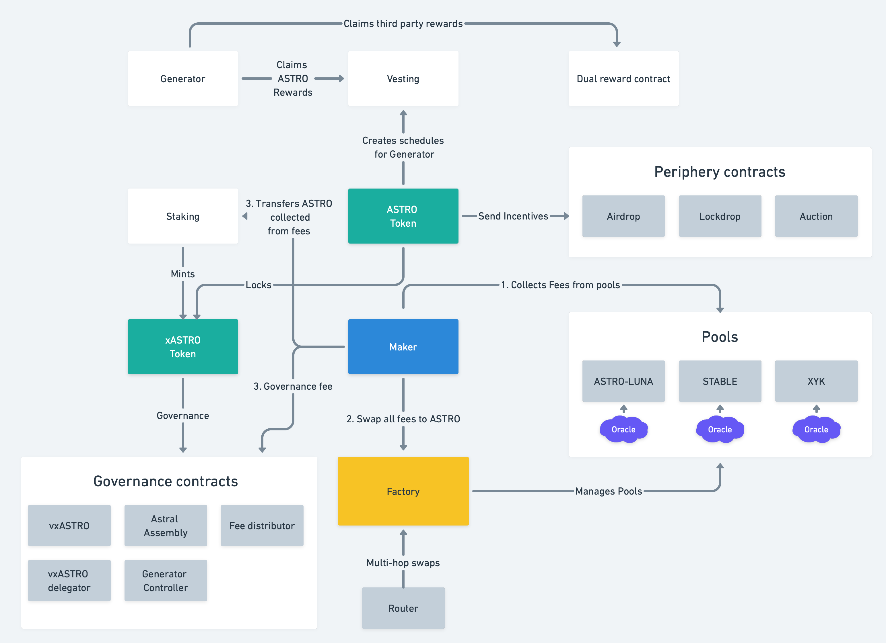

# Astroport Core

[](https://codecov.io/gh/astroport-fi/astroport-core)

Multi pool type automated market-maker (AMM) protocol powered by smart contracts on the Terra, Injective, Neutron, Sei
and Osmosis
blockchains.

## Contracts diagram



## General Contracts

| Name                                               | Description                                                         |
|----------------------------------------------------|---------------------------------------------------------------------|
| [`factory`](contracts/factory)                     | Pool creation factory                                               |
| [`pair`](contracts/pair)                           | Pair with x*y=k curve                                               |
| [`pair`](contracts/pair_astro_converter)           | One way swap pair to convert ASTRO.cw20 to TokenFactory ASTRO       |
| [`pair_concentrated`](contracts/pair_concentrated) | Passive Concentrated Liquidity pair inspired by Curve v2 whitepaper |
| [`pair_stable`](contracts/pair_stable)             | Pair with stableswap invariant curve                                |
| [`pair_transmuter`](contracts/pair_transmuter)     | Constant sum pair with no fee ans slippage for 1:1 assets           |
| [`pair_xyk_sale_tax`](contracts/pair_xyk_sale_tax) | XYK pair with buy and sell taxes                                    |
| [`router`](contracts/router)                       | Multi-hop trade router                                              |
| [`whitelist`](contracts/whitelist)                 | CW1 whitelist contract (Astroport treasury)                         |

## Tokenomics Contracts

Tokenomics related smart contracts are hosted on ../contracts/tokenomics.

| Name                                                | Description                                                         |
|-----------------------------------------------------|---------------------------------------------------------------------|
| [`incentives`](contracts/tokenomics/generator)      | Rewards distributor for liquidity providers                         |
| [`maker`](contracts/tokenomics/maker)               | Fee collector and swapper                                           |
| [`staking`](contracts/tokenomics/staking)           | xASTRO staking contract                                             |
| [`vesting`](contracts/tokenomics/vesting)           | ASTRO distributor for generator rewards                             |
| [`xastro_token`](contracts/tokenomics/xastro_token) | xASTRO token contract (extended cw20 with onchain balances history) |

## Building Contracts

You will need Rust 1.68.0+ with wasm32-unknown-unknown target installed.

### You can compile each contract:

Go to contract directory and run

```
cargo wasm
cp ../../target/wasm32-unknown-unknown/release/astroport_token.wasm .
ls -l astroport_token.wasm
sha256sum astroport_token.wasm
```

### You can run tests for all contracts

Run the following from the repository root

```
cargo test
```

### For a production-ready (compressed) build:

Run the following from the repository root

```
./scripts/build_release.sh
```

The optimized contracts are generated in the artifacts/ directory.

## Deployment

You can find versions and commits for actual deployed
contracts [here](https://github.com/astroport-fi/astroport-changelog).

## Docs

Docs can be generated using `cargo doc --no-deps`

## Bug Bounty

The contracts in this repo are included in a [bug bounty program](https://www.immunefi.com/bounty/astroport).
