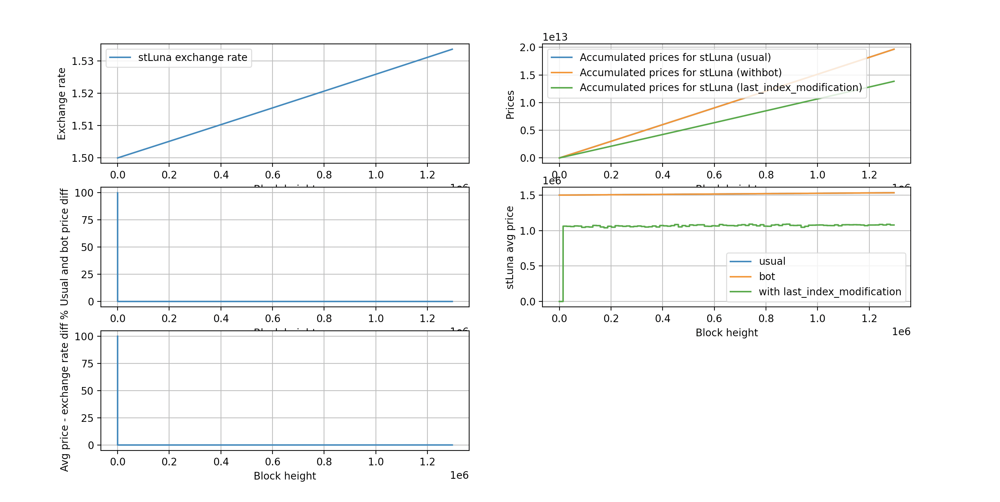

# Converter Contract

The Converter Contract contains the logic for swapping stLuna/bLuna tokens with the same API as [Astroport's native pool
contract](https://github.com/astroport-fi/astroport-core/tree/master/contracts/pair#executemsg), but it's just simply calls [Hub::Convert](https://docs.terra.lido.fi/contracts/hub#convert) under the hood.


## InstantiateMsg

Initializes a new converter contract.

```json
{
    "stluna_address": "terra1...",
    "bluna_address": "terra1...",
    "hub_address": "terra1...",
}
```

## ExecuteMsg

### `receive`

CW20 receive hander. Supports only Swap: {} message.

```json
{
  "receive": {
    "sender": "terra...",
    "amount": "123",
    "msg": "<base64_encoded_json_string>"
  }
}
```

### `provide_liquidity`

Not supported. Returns ```ContractError::NonSupported {}``` error.

### `withdraw_liquidity`

Not supported. Returns ```ContractError::NonSupported {}``` error.

### `swap`

Perform a swap. `offer_asset` is your source asset and `to` is the address that will receive the asked assets. All fields are optional except `offer_asset`.

Calls [Hub::Convert](https://docs.terra.lido.fi/contracts/hub#convert) under the hood.

NOTE: You should increase token allowance before swap.

```json
  {
    "swap": {
      "offer_asset": {
        "info": {
          "native_token": {
            "denom": "uluna"
          }
        },
        "amount": "123"
      },
      "belief_price": "123",
      "max_spread": "123",
      "to": "terra..."
    }
  }
```

### `update_config`

Not supported. Returns ```ContractError::NonSupported {}``` error.

## QueryMsg

All query messages are described below. A custom struct is defined for each query response.

### `pair`

Retrieve a pair's configuration (type, assets traded in it etc)

```json
{
  "pair": {}
}
```

### `pool`

*Returns the amount of tokens in the pool for all assets as well as the amount of LP tokens issued.*

In the case of the converter contract, *amount of tokens in the pool for all assets* means *the total amount of issued tokens for all assets* and *LP tokens issued* is always zero since the contract does not have any LP token logic.

```json
{
  "pool": {}
}
```

### `config`

Get the pair contract configuration.

```json
{
  "config": {}
}
```

### `share`

*Returns the amount of assets someone would get from the pool if they were to burn a specific amount of LP tokens.*

In the case of the contract always returns an empty array since the converter contract does not support LP tokens.

```json
{
  "share": {
    "amount": "123"
  }
}
```

### `simulation`

*Simulates a swap and returns the spread and commission amounts.*

The spread and commission amounts equal to zero since no actual pool swap happens.

```json
{
  "simulation": {
    "offer_asset": {
      "info": {
        "native_token": {
          "denom": "uusd"
        }
      },
      "amount": "1000000"
    }
  }
}
```

### `reverse_simulation`

*Reverse simulates a swap (specifies the ask instead of the offer) and returns the offer amount, spread and commission.*

The spread and commission amounts equal to zero since no actual pool swap happens.

```json
{
  "reverse_simulation": {
    "ask_asset": {
      "info": {
        "token": {
          "contract_addr": "terra..."
        }
      },
      "amount": "1000000"
    }
  }
}
```

### `cumulative_prices`

Returns the cumulative prices for the assets in the pair.

```json
{
  "cumulative_prices": {}
}
```


## TWAP

TWAP stands for the time-weighted average price. It's a reliable average price that can exclude short-term price fluctuation or manipulation and has been widely used in DeFi ([How does Astroport use this](https://docs.astroport.fi/astroport/smart-contracts/oracles#time-weighted-average-prices))

The time-weighted price algorithm is quite simple: the price P, multiplied by its duration T, is continuously added to a cumulative value C. ([more info](https://docs.uniswap.org/protocol/V2/concepts/core-concepts/oracles)).

Because the price of stLuna increases every hour, calculating the cumulative price of stLuna could be problematic to the converter contract. For example, if no swaps are made for an extended period of time, the converter would be incapable of calculating the right duration for the last price.

We see three solutions to this problem:
* to implement a bot which will update the cumulative price in the converter contract each time the stLuna exchange rate changes in the hub;  
* to query the `last_index_modification` field from the hub (returns the last time the stLuna exchange rate changed) to properly calculate the stLuna price duration;
* to make no changes to the code.

We've written a simple script which simulates all three options:



* The upper left chart shows the stLuna exchange rate growth.

* The upper right chart shows accumulated prices for **each of the three** methods: the usual and bot-assisted calculations yield similar results (the percentage difference between those can be seen on the middle left chart - ~0.0005%), whereas `last_index_modification` produces lower values. This is because the converter uses the right price duration (T), but doesn't add it to the total accumulated value (C).

* The lower left image shows that the difference between the average stLuna price from the converter contract and the stLuna exchange rate from the Hub fluctuates around ~0.035 percents.

We thus decided against making changes to the existing code, since it is already highly accurate without the addition of a bot.

### How to run a simulation

* Install dependencies:
```
pip3 install -r simulation/requirements.txt
```

* Run the script
```
python3 simulation/simulation.py
```
