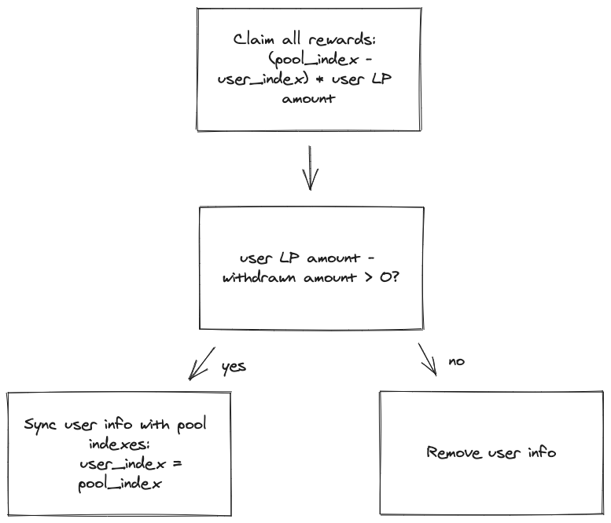
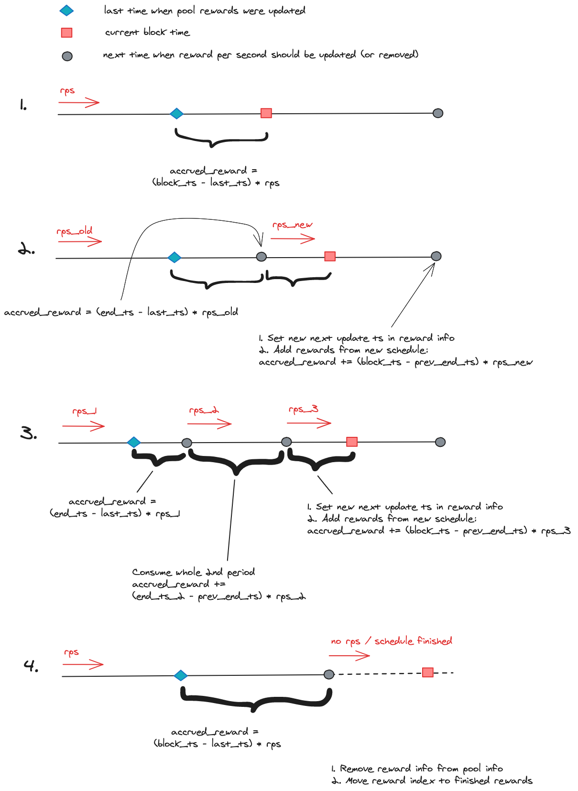

# Astroport Incentives (formerly Generator)

The Astroport Incentives contract allocates token rewards for various LP tokens and distributes them pro-rata to LP stakers.
This is completely reworked version of the original [Generator](https://github.com/astroport-fi/astroport-core/tree/main/contracts/tokenomics/generator) contract.
In this version we support both cw20 and native LP tokens. New generator also got rid of proxy contracts and made it much easier to add incentives (permissonless!).
However, generator could require incentivization fee to be paid to add new reward schedule which is exclusively needed to prevent spamming.
One more improvement is that ASTRO emissions are counted by seconds instead of blocks which makes more sense since Astroport is multichain protocol.

## Endpoints Description
Contract supports following execute endpoints:
- `setup_pools` - is meant to be called either by owner or generator controller. Reset previous active pools and set new alloc points.
- `deposit` - stake LP tokens in the generator in order to receive rewards. Rewards are updated and withdrawn automatically. All pools registered the Astroport factory are stakable. However, it doesn't mean that the pool is incentivized.
- `withdraw` - withdraw part or all LP tokens from the generator. Rewards are updated and withdrawn automatically.
- `claim_rewards` - update and withdraw all rewards associated with the LP tokens. This endpoint accepts multiple LP tokens.
- `set_tokens_per_second` - set new number of ASTRO emissions per second. Only owner can call this endpoint.
- `incentivize` - add new reward schedule to a specific pool. All overlapped schedules are thoroughly considered and summed up. This is permissonless endpoint. However, it requires to pay incentivization fee in case this reward is new.
- `remove_reward_from_pool` - completely remove reward from pool. However, all accrued rewards will be considered at current point. This endpoint can be called only by owner. One must supply remaining rewards receiver address.
- `update_config` - is meant to update general contract settings. Only owner can call this endpoint.
- `update_blocked_tokens_list` - update list of tokens that are not allowed to be incentivized with ASTRO as well as can't be used as external rewards. Only owner can call this endpoint.
- `deactivate_pool` - only factory can call this endpoint. Called from deregistration context in factory.
- `propose_new_owner`, `drop_ownership_proposal`, `claim_ownership` - endpoints to change ownership. Only current owner can propose new owner or drop proposal and only proposed owner can claim ownership.

### Deposit
Anyone can deposit either through direct `deposit` call with native LP tokens supplied or via cw20 send hook. 
Contract checks if LP token corresponds to a pair registered in factory. Any LP token is stakable by default although it doesn't mean that it is incentivized in generator.

### Withdraw
Partially or fully withdraw LP tokens from the generator. Rewards are updated and withdrawn automatically.

### Incentivize
Add new reward schedule to a specific pool. All overlapped schedules are thoroughly considered and summed up. 
This is permissonless endpoint. However, it requires to pay incentivization fee in case this reward is new.
Reward schedules are counted by periods where period is one week. Each period starts on Monday 00:00 UTC and ends on Sunday 23:59 UTC.
New reward schedule always starts right away and lasts **till the next Monday + X weeks**, where X - number of weeks specified in the schedule.

See in figure below possible scenarios. The first line represents current reward schedule, 
2nd red line shows new reward schedule and 3rd line shows the result.

### Update pool rewards
This is internal logic which is launched whenever LP tokens amount changes, new reward schedule is added or rewards are claimed.
Each time _update_rewards_ is called, accrued rewards / total LP staked value is added to the current reward index.
_rps_ - rewards per second

## Limitations and requirements
1. Chain doesn't allow to mint native tokens in the form of bech32 addresses. 
I.e. `wasm1xxxxxxx` denom is prohibited but `factory/wasm1xxxxxxx/astroport_lp` is allowed.
2. Chain has TokenFactory module. Produced denom strictly follows these [rules](https://github.com/osmosis-labs/osmosis/tree/main/x/tokenfactory#expectations-from-the-chain)
3. Generator assumes active pool set size is bounded to a reasonable value (i.e. max 30). Generator controller and owner must consider this. 
Otherwise, some endpoints working with active pools might fail due to gas limit.